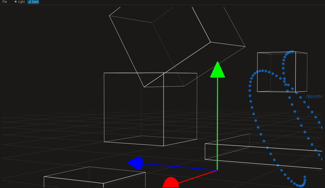

# egui_draw3d

Unholy experiment, trying to draw 3d shapes in a viewport using only egui's **epaint** 2d library and **glam**.
This is in very early stages and might not go anywhere. 
there is no Z sorting at the moment so everything gets drawn in the order you add it .
Performance starts to drop quite a lot when you reach ~ 1 mil drawn lines.

### Features:
- polymesh
- cube / bbox
- vector
- pointcloud 
- point/sphere light
- grid
- perspective camera

### Might be added:
- more light shapes
- transformation gizmos
- primitive per object Z sorting
- selection system

## run example
`cargo run --release --example viewport`

use Maya-style navigation (ALT + LMB orbit, ALT+MMB pan , scroll to zoom)

